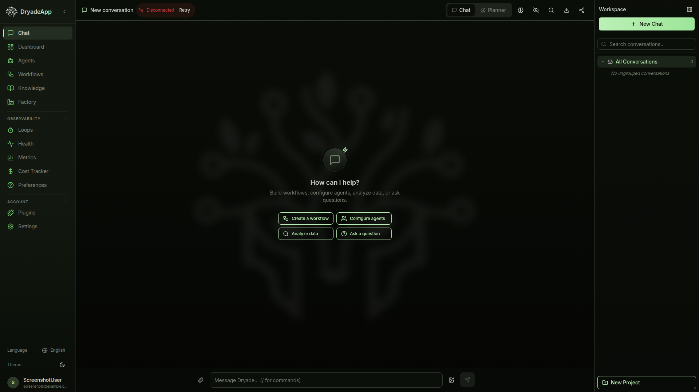

<p align="center">
  
</p>

<h3 align="center">
  <b>Self-hosted AI orchestration with full data sovereignty</b>
</h3>

<p align="center">
  Run any LLM locally. Orchestrate agents. Keep your data on your hardware.
</p>

<p align="center">
  <a href="https://github.com/DryadeAI/Dryade/stargazers"></a>
  <a href="LICENSE"></a>
  <a href="https://www.python.org/downloads/"></a>
  <a href="https://github.com/DryadeAI/Dryade/actions"></a>
  <a href="https://discord.gg/bvCPwqmu"></a>
  <a href="https://github.com/astral-sh/ruff"></a>
  <a href="https://github.com/DryadeAI/Dryade/commits/main"></a>
</p>

---

## What is Dryade?

Dryade is an AI orchestration platform you run on your own hardware. Connect any LLM provider -- local models via vLLM or Ollama, or cloud APIs like OpenAI and Anthropic -- and orchestrate intelligent agents that actually do things. Your conversations, your data, and your models never leave your infrastructure. No telemetry, no cloud dependency, no vendor lock-in.

<p align="center">
  
</p>

## Quick Start

Get Dryade running in under a minute:

```bash
git clone https://github.com/DryadeAI/Dryade.git
cd Dryade
cp .env.example .env
docker compose up -d
```

Open **[http://localhost:3000](http://localhost:3000)** and start chatting.

> By default, Dryade connects to a local Ollama instance. Edit `.env` to switch to any LLM provider. See the [Configuration Guide](docs/configuration.md) for all options.

<details>
<summary><b>Manual setup (without Docker)</b></summary>

For developers who want to work directly with the Python codebase:

```bash
git clone https://github.com/DryadeAI/Dryade.git
cd Dryade
uv venv && source .venv/bin/activate
uv sync
cp .env.example .env
# Edit .env with your LLM provider settings

uvicorn core.api.main:app --host 0.0.0.0 --port 8080
```

For the frontend:

```bash
cd dryade-workbench
npm install
npm run dev
```

</details>

<details>
<summary><b>With local GPU inference (vLLM)</b></summary>

If you have an NVIDIA GPU, run a local model alongside Dryade:

```bash
docker compose --profile gpu up -d
```

This starts a vLLM instance serving Qwen3-8B. Update `VLLM_MODEL` in `.env` to change the model. See the [Edge Hardware Guide](docs/edge-hardware.md) for Jetson and DGX Spark configurations.

</details>

## Features

<table>
<tr>
<td width="50%">

**Multi-Agent Orchestration**

ReAct loop with three modes: Chat for conversations, Planner for structured reasoning, and Orchestrate for autonomous multi-step workflows.

</td>
<td width="50%">

**MCP Server Integration**

Connect external tools and services through the Model Context Protocol. Semantic and regex-based routing across all connected servers.

</td>
</tr>
<tr>
<td>

**Knowledge Base / RAG**

Ingest documents, build semantic search indexes, and give your agents access to your organization's knowledge.

</td>
<td>

**Visual Workflow Builder**

Drag-and-drop agent pipelines with ReactFlow. Design, connect, and execute complex multi-agent workflows visually.

</td>
</tr>
<tr>
<td>

**Any LLM Provider**

Works with Ollama, vLLM, OpenAI, Anthropic, Google, and any OpenAI-compatible API. Switch providers without changing your workflows.

</td>
<td>

**Edge Hardware Native**

Runs natively on NVIDIA Jetson and DGX Spark with local models. Built for environments where data cannot leave the device.

</td>
</tr>
<tr>
<td>

**Plugin Ecosystem**

Extend Dryade with marketplace plugins for monitoring, security, compliance, and vertical industry workflows. [Create your own plugins](docs/plugins.md) and sell them on the Dryade marketplace.

</td>
<td>

**Full API**

REST and WebSocket APIs with real-time streaming. OpenAPI-documented endpoints for integration with your existing tools and pipelines. See the [API Reference](docs/api-reference.md).

</td>
</tr>
</table>

## Architecture

```
User <-> Workbench UI (React/TypeScript)
              |
         FastAPI Backend
              |
     DryadeOrchestrator (ReAct loop)
        /    |    \
   Chat  Planner  Orchestrate
              |
   HierarchicalToolRouter
     (semantic + regex matching)
        /         \
  MCP Servers    Plugins
        |
  LLM Providers
  (vLLM / Ollama / OpenAI / Anthropic / Google)
```

## Framework Adapters

Dryade connects to agent frameworks through a unified adapter pattern:

| Framework | Description |
|-----------|-------------|
| **MCP** | Model Context Protocol -- native integration with MCP servers |
| **CrewAI** | Multi-agent crew orchestration |
| **ADK** | Google Agent Development Kit integration |
| **LangChain** | LangChain tool and chain execution |
| **A2A** | Agent-to-Agent protocol for inter-agent communication |

## Deployment Options

| Method | Best For | Guide |
|--------|----------|-------|
| Docker Compose | Most users, production | [Deployment Guide](docs/deployment.md) |
| Manual (Python + uv) | Development, contributors | [Getting Started](docs/getting-started.md) |
| Edge Hardware | Jetson, DGX Spark, local AI | [Edge Guide](docs/edge-hardware.md) |

<details>
<summary><b>Comparison with alternatives</b></summary>

| Feature | Dryade | Dify | n8n | Langflow |
|---------|:------:|:----:|:---:|:--------:|
| Self-hosted | Yes | Yes | Yes | Yes |
| Data sovereignty (zero telemetry) | Yes | Partial | Partial | Yes |
| Edge hardware support (Jetson, DGX) | Yes | No | No | No |
| MCP server integration | Yes | No | No | No |
| Multi-framework adapters (CrewAI, ADK, A2A) | Yes | No | No | No |
| Visual workflow builder | Yes | Yes | Yes | Yes |
| Plugin marketplace | Yes | No | No | No |
| RAG / Knowledge base | Yes | Yes | No | Yes |
| Local LLM support (vLLM, Ollama) | Yes | Yes | Partial | Yes |
| REST + WebSocket API | Yes | Yes | Yes | Yes |
| Real-time streaming | Yes | Yes | Yes | Yes |

</details>

## Community

- **Discord** -- [discord.gg/bvCPwqmu](https://discord.gg/bvCPwqmu) for questions, discussions, and support
- **GitHub Discussions** -- [Q&A, Ideas, Show & Tell](https://github.com/DryadeAI/Dryade/discussions)
- **Contributing** -- Read the [Contribution Guide](CONTRIBUTING.md) to get started
- **Examples** -- [Quickstart projects](examples/) to get running in 5 minutes
- **Marketplace** -- Create your own plugins and sell them on the [Dryade marketplace](https://dryade.ai/marketplace)
- **Documentation** -- [dryade.ai/docs](https://dryade.ai/docs) for guides, API reference, and tutorials

## Star History

[](https://star-history.com/#DryadeAI/Dryade&Date)

## Contributors

<a href="https://github.com/DryadeAI/Dryade/graphs/contributors">
  
</a>

## Roadmap

- **A2A Server Endpoint** -- Expose Dryade agents for discovery by external orchestrators
- **Enhanced Plugin SDK** -- Improved developer experience for building and distributing plugins
- **Kubernetes Deployment Guide** -- Helm charts and production-grade K8s deployment
- **More Framework Adapters** -- Expanding the adapter pattern to additional agent frameworks
See the [GitHub Milestones](https://github.com/DryadeAI/Dryade/milestones) for detailed progress.

## License

Dryade is licensed under the [Dryade Source Use License (DSUL)](LICENSE). Enterprise features in `core/ee/` are under [separate terms](LICENSE_EE.md).

## Contact

- **Commercial licensing:** [licensing@dryade.ai](mailto:licensing@dryade.ai)
- **Security issues:** [security@dryade.ai](mailto:security@dryade.ai) (see [Security Policy](SECURITY.md))
- **General inquiries:** [dryade.ai](https://dryade.ai)
